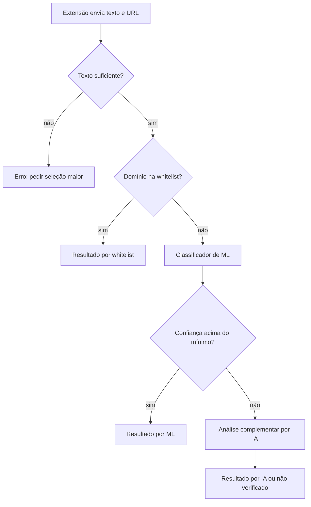

# Fake News Residência

Extensão de navegador (Chrome) que ajuda o usuário a avaliar a confiabilidade de textos na web, **sem substituir o pensamento crítico**. O sistema alerta e explica os critérios usados, mas não decreta o que é verdade ou mentira.

> Projeto do desafio **Fake News / Desinformação** da Residência em IA da UnB. Em desenvolvimento.

## Status

| Componente | Estado |
|---|---|
| Back-end: estrutura base e `/health` | concluído |
| Back-end: configuração, contrato da API e whitelist | em andamento |
| Back-end: endpoint `/analyze` e pipeline de análise | a fazer |
| Modelo de Machine Learning | a treinar |
| Análise complementar por IA (fallback) | a fazer |
| Extensão | (preencher) |

## O que o projeto faz

Escopo do MVP, conforme os [requisitos](docs/requisitos.md):

- Análise de um trecho selecionado ou do conteúdo principal da página
- Verificação do domínio contra uma whitelist de fontes confiáveis
- Classificação do texto por Machine Learning, com nível de confiança
- Análise complementar por IA quando a confiança do modelo é baixa
- Classificação em **confiável**, **suspeito** ou **não verificado**
- Exibição do método usado, da confiança e dos critérios da análise
- Tratamento claro de falhas e de conteúdo insuficiente

## Como funciona



Conteúdo sem evidência suficiente é classificado como **não verificado**, e nunca como falso. Uma falha de comunicação ou de um mecanismo de análise nunca é apresentada como resultado.

## Estrutura do repositório

```
.
├── backend/      API em Python (FastAPI)
├── extension/    Extensão do navegador
├── ml/           Modelos de Machine Learning (ainda a treinar)
├── docs/         Documentação e requisitos
└── .github/      Templates de issue e de pull request
```

## Como rodar o back-end

Requisitos: Python 3.12 ou superior. No Ubuntu/Debian, instale também o módulo de ambientes virtuais: `sudo apt install python3-venv`.

```bash
git clone https://github.com/Withy-S/Fake_News_Residencia.git
cd Fake_News_Residencia/backend

python3 -m venv .venv
source .venv/bin/activate        # Windows: .venv\Scripts\activate
pip install -r requirements.txt

cp .env.example .env
uvicorn app.main:app --reload
```

A documentação interativa da API fica em http://127.0.0.1:8000/docs.

Para rodar os testes e o lint, sempre de dentro de `backend/`:

```bash
pytest -q
ruff check . && ruff format .
```

## Configuração

Os parâmetros ficam em variáveis de ambiente (arquivo `backend/.env`, criado a partir do `.env.example`). O `.env` nunca vai para o Git.

| Variável | Descrição | Padrão |
|---|---|---|
| `FN_MIN_TEXT_LENGTH` | Tamanho mínimo do texto para análise | `20` |
| `FN_MIN_CONFIDENCE` | Confiança mínima do modelo antes do fallback | `0.6` |
| `FN_FALLBACK_METHOD` | Mecanismo usado como fallback | `ai_fallback` |
| `FN_TRUSTED_DOMAINS` | Whitelist de domínios, em JSON | `[]` |
| `FN_REQUEST_TIMEOUT_SECONDS` | Timeout das requisições | `10` |
| `FN_ALLOWED_ORIGINS` | Origens permitidas (CORS), em JSON | `[]` |

Os valores padrão são provisórios e podem mudar conforme as decisões do grupo.

## Endpoints

| Método | Rota | Estado |
|---|---|---|
| GET | `/api/v1/health` | disponível |
| POST | `/api/v1/analyze` | em desenvolvimento |

## Requisitos e escopo

Os requisitos funcionais e não funcionais estão em [`docs/requisitos.md`](docs/requisitos.md), com prioridade **MVP**, **V2** ou **Futuro**. Ficam para V2, entre outros: análise de imagens, recomendação de fontes, histórico local e feedback do usuário.

## Princípios

- As classificações são **estimativas automáticas**, sujeitas a erros, e não determinações de verdade.
- Coletar e transmitir apenas os dados necessários para a análise.
- Segredos e chaves nunca ficam no código-fonte.

## Como contribuir

1. Crie uma branch a partir da `main`: `feat/nome`, `fix/nome` ou `docs/nome`.
2. Use [Conventional Commits](https://www.conventionalcommits.org/pt-br/v1.0.0/): `feat:`, `fix:`, `docs:`, `test:`, `chore:`.
3. Rode `pytest -q` e `ruff check .` antes de abrir o PR.
4. Prefira PRs pequenos e peça revisão a pelo menos uma pessoa do grupo.

## Equipe

Davi 
Mayara
Miti
Rafaella
Rayssa

## Licença

A definir.
